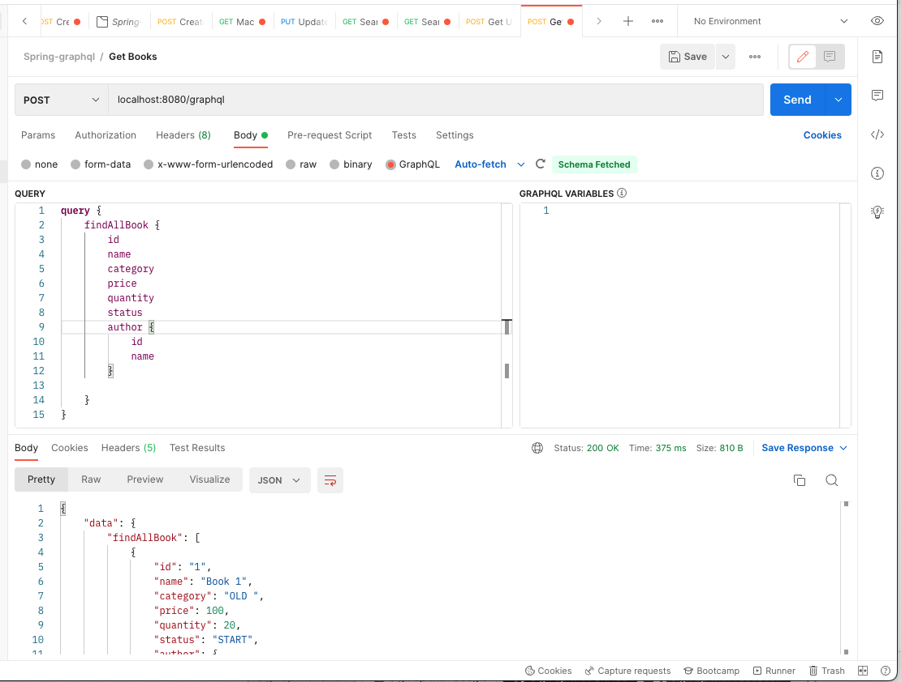

# spring-graphql-example

* Goals
    * Setup GraphQL in spring
    * Mapping Query from GraphQL to Controller
    * Call API by using `postman` tool
      

* **Note**: There is no difference between `@Repository` and `@GraphQlRepository` in this example
